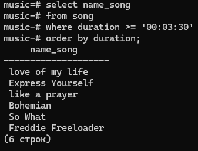
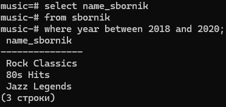
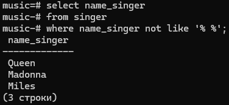
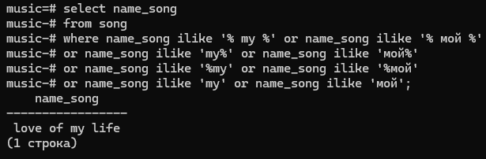
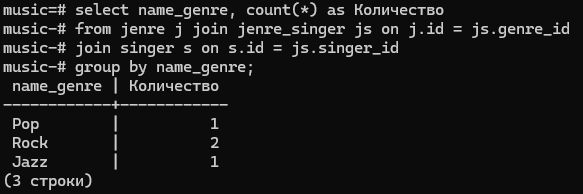
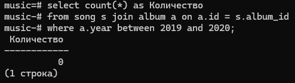
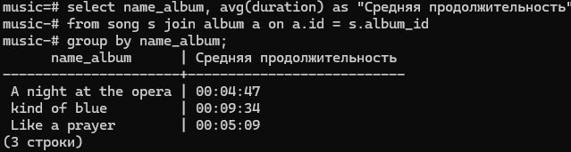
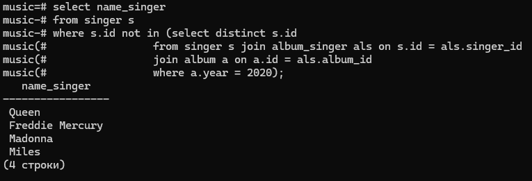
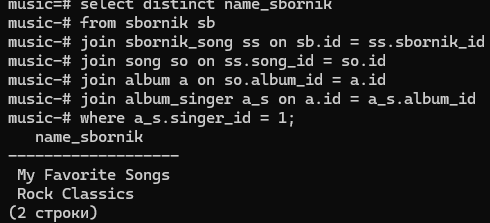

# Заполенение таблиц и sql-запросы на выборку

## все sql-запросы (на создание и выборку) тут:
[sql-запросы](sql3.sql)

## Скрины запросов (вывод)

### Название треков, продолжительность которых не менее 3,5 минут.

### Названия сборников, вышедших в период с 2018 по 2020 год включительно.

### Исполнители, чьё имя состоит из одного слова.

### Название треков, которые содержат слово «мой» или «my».

### Количество исполнителей в каждом жанре.

### Количество треков, вошедших в альбомы 2019–2020 годов.

### Средняя продолжительность треков по каждому альбому.

### Все исполнители, которые не выпустили альбомы в 2020 году.

### Названия сборников, в которых присутствует конкретный исполнитель (Queen, 1).
